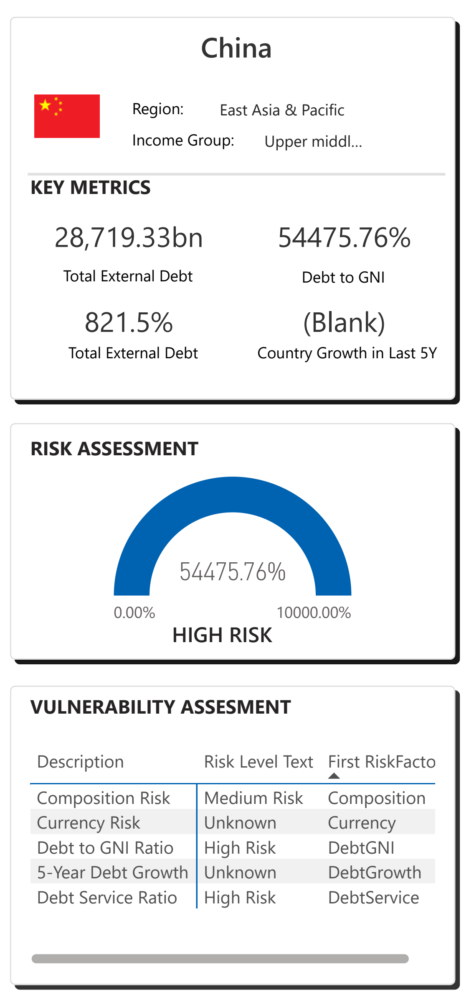
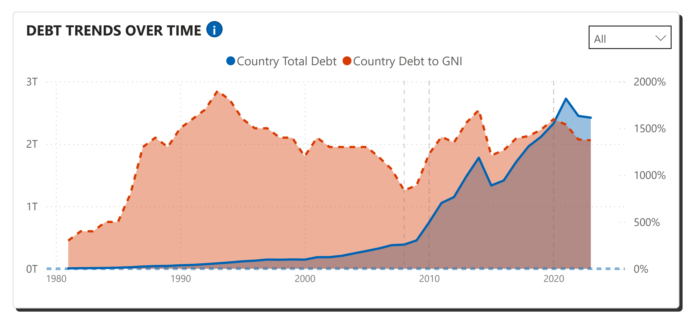

# International Debt Statistics Dashboard

A comprehensive Power BI dashboard for analyzing and visualizing international debt statistics across different regions and countries.


## Project Overview

This project provides interactive visualizations and analysis tools for international debt statistics. It enables users to compare regional debt metrics, track debt trends over time, and analyze various debt indicators across countries and regions.

### Key Features

- **Regional Comparison Dashboard**: Compare debt metrics across different global regions
- **Country-Level Analysis**: Drill down into specific countries for detailed debt analysis
- **Trend Analysis**: Track debt changes over time with interactive line charts
- **Key Performance Indicators**: Monitor critical debt metrics including debt-to-GDP ratio and debt service ratios
- **Interactive Filtering**: Filter data by region, year, and other dimensions
- **Responsive Design**: Optimized layout for various screen sizes

## Technical Architecture

### Data Source
The dashboard uses data from the World Bank's International Debt Statistics dataset:
- **Source URL**: [World Bank Data Catalog - International Debt Statistics](https://datacatalog.worldbank.org/search/dataset/0038015/International-Debt-Statistics)
- **Database**: Microsoft SQL Server
- **Update Frequency**: Annual

### Technology Stack
- **Database**: Microsoft SQL Server
- **Data Visualization**: Microsoft Power BI
- **Data Processing**: T-SQL for data preparation and aggregation
- **Version Control**: Git/GitHub

### Data Model
The solution is built on a structured data model with:
- **Countries**: Contains country metadata including regions and income groups
- **DebtData**: Main fact table with debt statistics
- **Series**: Contains information about different debt metrics/indicators

## Dashboard Components

### Regional Comparison Page
- Geographic map visualization of regional debt
- Key debt metrics by region
- Comparative bar charts for regional analysis
- Trend analysis for historical context
- Detailed tables with debt metrics

### Country Detail Page
- Country-specific debt analysis
- Historical debt trends
- Debt composition breakdown
- Comparative metrics against regional averages

## Implementation Details

### DAX Measures
The dashboard utilizes several custom DAX measures including:

```
// Total Regional Debt
Total Regional Debt = 
CALCULATE(SUM(DebtData[Value]), DebtData[SeriesCode]="DT.DOD.DECT.CD", ALLEXCEPT(DebtData, DebtData[CountryCode]))

// Regional Debt to GNI Ratio
Regional Debt to GNI Ratio = 
DIVIDE([Total Regional Debt], SUM(DebtData[Value]), 0)

// YoY Growth Rate
Regional Debt YoY Growth = 
VAR CurrentYear = MAX(DebtData[Year])
VAR CurrentYearDebt = CALCULATE([Total Regional Debt], DebtData[Year] = CurrentYear)
VAR PreviousYearDebt = CALCULATE([Total Regional Debt], DebtData[Year] = CurrentYear - 1)
RETURN DIVIDE(CurrentYearDebt - PreviousYearDebt, PreviousYearDebt, 0)

// Debt Concentration Ratio
Debt Concentration Ratio = 
VAR Top3Debt = CALCULATE(
    SUM(DebtData[Value]),
    TOPN(3, VALUES(Countries[ShortName]), CALCULATE(SUM(DebtData[Value])), DESC)
)
RETURN DIVIDE(Top3Debt, [Total Regional Debt], 0)
```

### SQL Queries
Core data preparation is handled through SQL, including:

```sql
-- Regional debt analysis
SELECT 
    c.Region,
    d.Year,
    SUM(CASE WHEN d.SeriesCode = 'DT.DOD.DECT.CD' THEN d.Value ELSE 0 END) AS TotalExternalDebt,
    AVG(CASE WHEN d.SeriesCode = 'DT.DOD.DECT.GN.ZS' THEN d.Value END) AS AvgDebtToGNIRatio,
    AVG(CASE WHEN d.SeriesCode = 'DT.TDS.DECT.EX.ZS' THEN d.Value END) AS AvgDebtServiceRatio
FROM 
    DebtData d
JOIN 
    Countries c ON d.CountryCode = c.CountryCode
WHERE 
    d.Year BETWEEN 2013 AND 2022
    AND c.Region IS NOT NULL
    AND d.SeriesCode IN ('DT.DOD.DECT.CD', 'DT.DOD.DECT.GN.ZS', 'DT.TDS.DECT.EX.ZS')
GROUP BY 
    c.Region, d.Year
```

## Setup and Usage

### Prerequisites
- Power BI Desktop (latest version recommended)
- SQL Server 2019 or later (for database components)

### Installation
1. Clone this repository
2. Execute the SQL scripts in the database folder to set up your database
3. Open the `InternationalDebtDashboard.pbix` file in Power BI Desktop
4. Update the data source connection to point to your SQL Server instance
5. Refresh the data

### Usage Guide
1. Use the filters at the top to select regions and time periods
2. Click on regions in the map for detailed information
3. Use the tabs at the top to navigate between different dashboard pages
4. Export data or generate reports using Power BI's built-in export functionality

## Future Enhancements
- Integration with live data sources for real-time updates
- Machine learning forecasting for debt trend prediction
- Additional metrics including sustainability indicators
- Mobile-optimized view for on-the-go analysis

## Screenshots



## Author
- [Tushar Dhawale](https://github.com/tushardhawale123)

## License
This project is licensed under the MIT License - see the LICENSE file for details.
